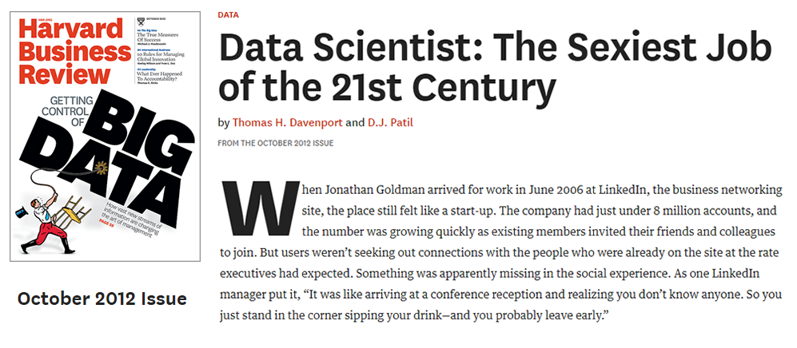
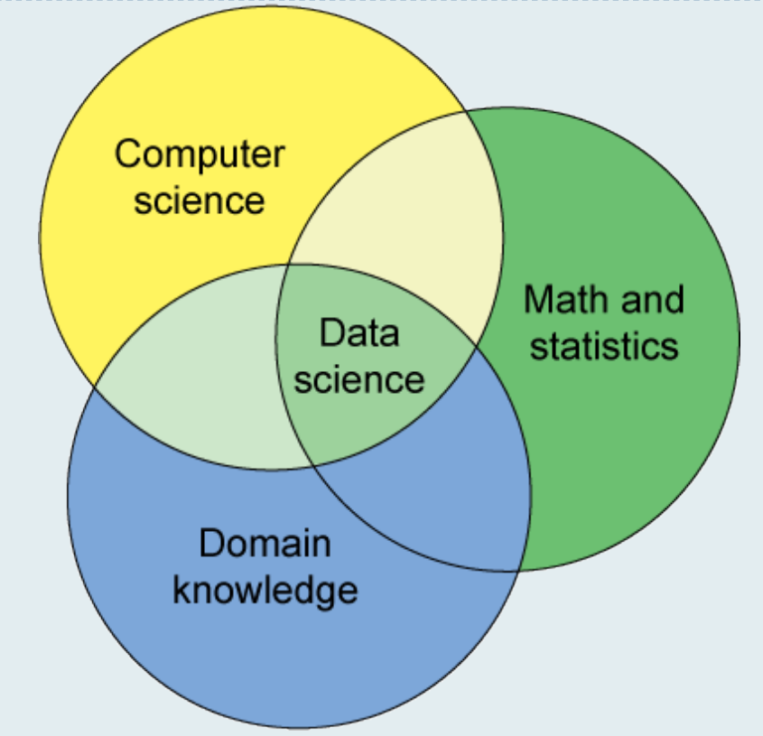
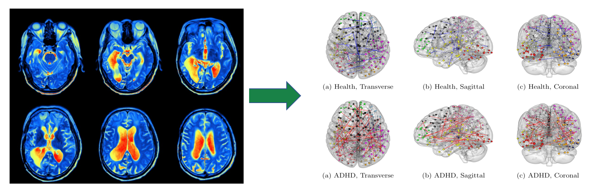
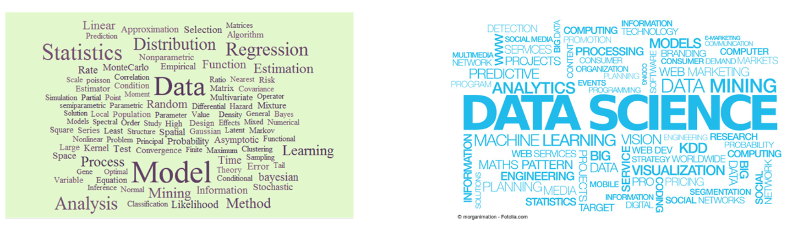
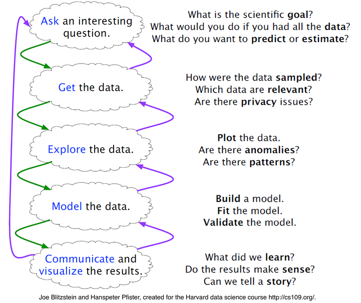
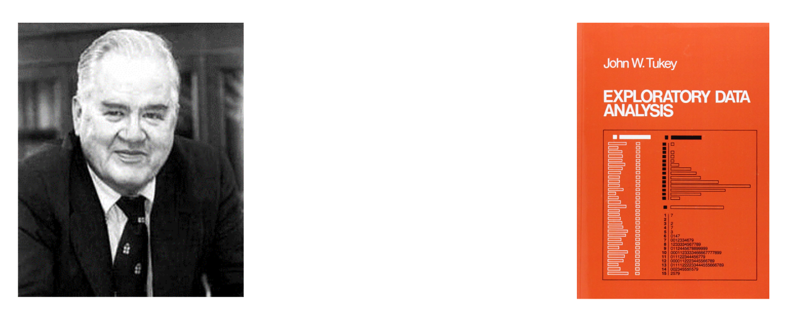
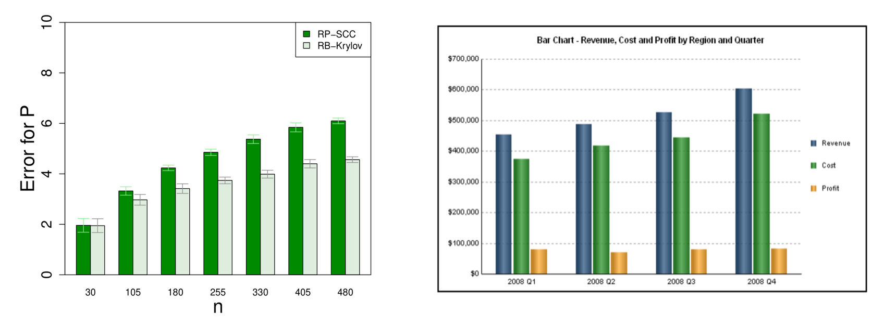
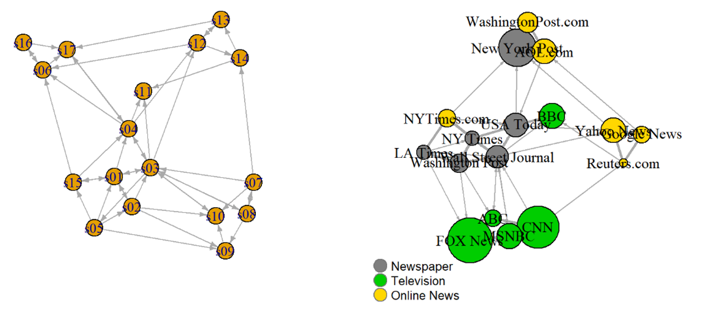

```{r setup, include=FALSE}
knitr::opts_chunk$set(echo = FALSE)
```

## Data scientist: the sexy job

```{r}



```

- See also an old article by NYT (2009): For Today’s Graduate, Just One Word: Statistics

- And another famous McKinseay 2011 Report: Big data: The next frontier for innovation, competition, and productivity


## What is a data scientist?

- Nate Silver (FiveThirtyEight, author of The Signal and the Noise): "Data scientist is just a sexed up word for a statistician."
```{r}

```

- "A data scientist is someone who knows more statistics than a computer scientist and more computer science than a statistician.” (from Joshua Blumenstock)

## Data science is all the rage

```{r,out.width=160,fig.align='center'}

```

## An example: structure learning from fMRI data

```{r,out.width=260,fig.align='center'}

```

- Statistics for modeling
- Computer science for optimizing
- Domain knowledge for explanation

## Data science vs Statistics
```{r}

```


## L. Breiman (2001): Statistical modeling: the two cultures

```{r}
knitr::include_graphics("twocluture.png")
```


## A good portrait of data scientist by Bin Yu

- Statistics (S) 
- Domain (science) knowledge (D) 
- Computing (C) 
- Collaboration (“team work”) (C) 
- Communication (to outsiders) (C) 

Data Science = SDC^3
```{r,out.width=100,fig.align='right'}

```

## 

Statisticians do a big part of the job of a data scientist.

No existing discipline does more of the job of a data scientist 

## To fortify our position in DS, we should focus on

- Critical thinking: enables Statistics + Domain knowledge 
- Computing: parallel computation, memory and communication dominate scalability
- Leadership, interpersonal, and communication: abilities enable collaboration + communication with outside

## Data science workflow

```{r,out.width=250,fig.align='center'}

```

## Roles of data visualization
- Role 1: Exploratory data analysis (pre stage);

- Role 2: Visual presentation of results (after stage).

- John W. Tukey (1977; Exploratory Data Analysis): "The greatest value of a picture is when it forces us to notice what we never expected to see.”

```{r,out.width=300,fig.align='center'}

```

## Principles of data visualization

- Determine your audience. What questions will they need answered?

```{r}

```

##

- Choose the right kind of chart (or other visualization) to depict the type of information you have.

- Provide the necessary context for data to be interpreted and acted upon appropriately.

- Keep it simple. Remove any non-essential information. 

- Choose colors carefully to draw attention while also considering accessibility issues such as contrast. 

## 
 
 - Seek balance in your visual elements, including texture, color, shape, and negative space.

```{r}

```

- Represent the data well. What information is missed? What is misinterpreted? 

## References 

- Data Visualization with R by Rob Kabacoff. 
https://rkabacoff.github.io/datavis/

- HKU Stat3622 Data Visualization.
https://ajzhanghk.github.io/Stat3622/

- R for Data Science (2017 O'Reilly) by Grolemund and Wickham. http://r4ds.had.co.nz/


