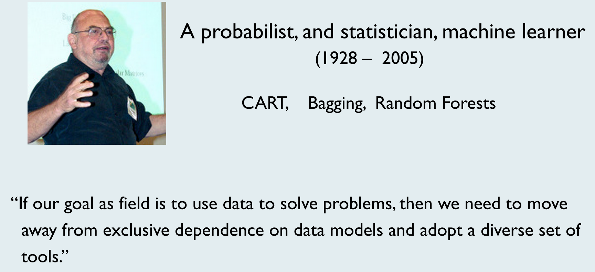

```{r setup, include=FALSE}
knitr::opts_chunk$set(echo = FALSE)
```


## A little bit about me

- Northwest University, 2020.04-present

- Northwest University, BS, MS, Ph.D., 2009-2019, supervised by Prof. Hai Zhang.

- Columbia University, Visiting student, 2018.10-2019.10, supervised by Prof. Ming Yuan.

- University of Wisconsin at Madison, Visiting student, 2015.10-2016.01

My current research focuses on high dimensional statistics and statistical machine learning. More specifically, 

- Network analysis, Clustering, Unsupervised learning methods

- Privacy-preserving statistical data analysis, Large-scale data analysis, Federated learning methods 

\center \textcolor{red}{\emph{Welcome to join us!}}

## Some examples in our project-World trading patterns

```{r,out.width=260,fig.align='center'}

knitr::include_graphics("worldtrade.png")

```


## Some examples in our project-Multi-site brain functional connectivities

```{r,out.width=260,fig.align='center'}

knitr::include_graphics("Bayesiannetwork.png")

```

## Some examples in our project-Air pollution patterns

```{r,out.width=260,fig.align='center'}

knitr::include_graphics("pm25.png")

```


## Data scientist: the sexy job

```{r}

knitr::include_graphics("HBR201210.png")

```

- See also an old article by NYT (2009): For Today’s Graduate, Just One Word: Statistics

- And another famous McKinseay 2011 Report: Big data: The next frontier for innovation, competition, and productivity


## What is a data scientist?

- Nate Silver (FiveThirtyEight, author of The Signal and the Noise): "Data scientist is just a sexed up word for a statistician."
```{r}

```

- "A data scientist is someone who knows more statistics than a computer scientist and more computer science than a statistician.” (from Joshua Blumenstock)

## Data science is all the rage

```{r,out.width=160,fig.align='center'}

```

## An example: structure learning from fMRI data

```{r,out.width=260,fig.align='center'}

```

- Statistics for modeling
- Computer science for optimizing
- Domain knowledge for explanation

## Data science vs Statistics
```{r}

```


## L. Breiman (2001): Statistical modeling: the two cultures

```{r}

```


## A good portrait of data scientist by Bin Yu

- Statistics (S) 
- Domain (science) knowledge (D) 
- Computing (C) 
- Collaboration (“team work”) (C) 
- Communication (to outsiders) (C) 

Data Science = SDC^3
```{r,out.width=100,fig.align='right'}

```

## 

Statisticians do a big part of the job of a data scientist.

No existing discipline does more of the job of a data scientist 

## To fortify our position in DS, we should focus on

- Critical thinking: enables Statistics + Domain knowledge 
- Computing: parallel computation, memory and communication dominate scalability
- Leadership, interpersonal, and communication: abilities enable collaboration + communication with outside

## Data science workflow

```{r,out.width=250,fig.align='center'}
knitr::include_graphics("DataScienceWorkflow1.png")
```

## Roles of data visualization
- Role 1: Exploratory data analysis (pre stage);

- Role 2: Visual presentation of results (after stage).

- John W. Tukey (1977; Exploratory Data Analysis): "The greatest value of a picture is when it forces us to notice what we never expected to see.”

```{r,out.width=300,fig.align='center'}

```

## Principles of data visualization

- Determine your audience. What questions will they need answered?

```{r}

```

##

- Choose the right kind of chart (or other visualization) to depict the type of information you have.

- Provide the necessary context for data to be interpreted and acted upon appropriately.

- Keep it simple. Remove any non-essential information. 

- Choose colors carefully to draw attention while also considering accessibility issues such as contrast. 

## 
 
 - Seek balance in your visual elements, including texture, color, shape, and negative space.

```{r}

```

- Represent the data well. What information is missed? What is misinterpreted? 


## R studio and R markdown

- RStudio is a popular IDE (Integrated Development Environment) for R programming.

- It is a powerful editor for R coding and debugging.

- It is a powerful generator for HTML, PDF, dynamic documents and slide shows.

- RStudio can be run on both Desktop and Cloud.

- Check out more nice features of RStudio at its official website.

## R studio IDE

```{r,out.width=300,fig.align='center'}
knitr::include_graphics("RstudioIDE.png")
```

## R markdown

https://rmarkdown.rstudio.com/index.html
https://rmarkdown.rstudio.com/lesson-1.html

- install.packages("rmarkdown") 
- install.packages("knitr") 
- install.packages("tinytex") 


## Course website

- https://github.com/XiaoGuo-stat/DataVisualization

Weekly update. 
```{r}
knitr::include_graphics("git.png")
```


##

```{r}
knitr::include_graphics("git2.png")
```


## Course materials

- Data Visualization with R by Rob Kabacoff. 
https://rkabacoff.github.io/datavis/

- HKU Stat3622 Data Visualization.
https://ajzhanghk.github.io/Stat3622/

- R for Data Science (2017 O'Reilly) by Grolemund and Wickham. http://r4ds.had.co.nz/

- Learning IPython for Interactive Computing and Data Visualization (2nd) by Rossant, C. (2015).
http://ipython-books.github.io/minibook/

## References

- HKU Stat3622 Data Visualization.
https://ajzhanghk.github.io/Stat3622/

- B. Yu (2014). Let us own data science. IMS Bulletin Institute of Mathematical Statistics (IMS) Presidental Address, ASC-IMS Joint Co nference, Sydney, July, 2014. 
https://www.stat.berkeley.edu/~binyu/ps/papers2014/IMS-pres-address14-yu.pdf

