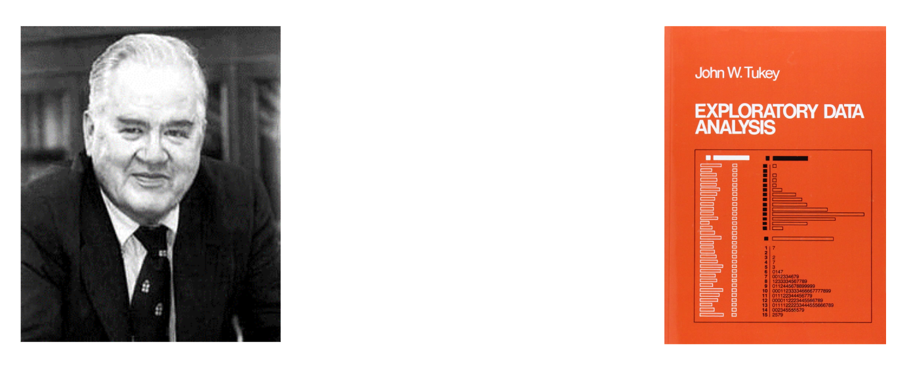

```{r setup, include=FALSE}
knitr::opts_chunk$set(echo = TRUE)
```

<style type="text/css">

body, td {
   font-size: 14px;
}
code.r{
  font-size: 20px;
}
pre {
  font-size: 20px
}
</style>

# 2.1. Exploratory Data Analysis

## Roles of Data Visualization 

- ### Role 1: Exploratory data analysis (pre stage);
- ### Role 2: Visual presentation of results (after stage).
- ### John W. Tukey (1977; Exploratory Data Analysis): "The greatest value of a picture is when it forces us to notice what we never expected to see.”

```{r,echo = FALSE}

```

## John Tukey (1915-2000)

### Proposed “Exploratory Data Analysis”  

- ### Coined terms: Boxplot, Stem-and-Leaf plot, ANOVA (Analysis of Variance)  

- ### Coined terms “Bit” and “Software”  

- ### Co-Developed Fast Fourier Transform algorithm, Projection Pursuit, Jackknife estimation  

- ### Famous quote: “The best thing about being a statistician is that you get to play in everyone's backyard.”
 
- ### https://en.wikipedia.org/wiki/John_Tukey 

## John Tukey: Exploratory Data Analysis (1977)


- ### Five-number summary

- ### Stem-and-Leaf plot

- ### Scatter plot

- ### Box-plot, Outliers

- ### Residual plot

- ### Smoother

- ### Bag plot (two or three dimensional 'box' plot)

# 2.2 R plot basics and colors

### `plot(x, y = NULL, type = "p",  xlim = NULL, ylim = NULL)`

- ### `x,y` the x and y arguments provide the x and y coordinates for the plot.
- ### `type` 1-character string giving the type of plot desired. The following values are possible, for details, see plot: "p" for points, "l" for lines, "b" for both points and lines, "c" for empty points joined by lines, "o" for overplotted points and lines, "s" and "S" for stair steps and "h" for histogram-like vertical lines. Finally, "n" does not produce any points or lines.
- ### `xlim` the x limits (x1, x2) of the plot. Note that x1 > x2 is allowed and leads to a ‘reversed axis’. The default value, NULL, indicates that the range of the finite values to be plotted should be used.
- ### `ylim` the y limits of the plot.
- ### `log` a character string which contains "x" if the x axis is to be logarithmic, "y" if the y axis is to be logarithmic and "xy" or "yx" if both axes are to be logarithmic.
- ### `main` a main title for the plot.
- ### `sub` a sub title for the plot.
- ### `xlab` a label for the x axis, defaults to a description of x.
- ### `ylab` a label for the y axis, defaults to a description of y.
- ### `axes` a logical value indicating whether both axes should be drawn on the plot. Use graphical parameter "xaxt" or "yaxt" to suppress just one of the axes.
- ### `frame.plot` a logical indicating whether a box should be drawn around the plot.

### Commonly used graphical parameters are:
- ### `col` The colors for lines and points. 
- ### `pch` a vector of plotting characters or symbols: see `points`.
- ### `cex` a numerical vector giving the amount by which plotting characters and symbols should be scaled relative to the default. This works as a multiple of par("cex"). NULL and NA are equivalent to 1.0. Note that this does not affect annotation: see below.
- ### `lty` a vector of line types.
- ### `lwd` a vector of line widths. 

### In most R functions, you can use named colors, hex, or RGB values. In the simple base R plot chart below, x and y are the point coordinates, pch is the point symbol shape, cex is the point size, and col is the color. To see the parameters for plotting in base R, check out ?par

```{r}
plot(x=1:10, y=rep(5,10), pch=19, cex=3, col="dark red")

points(x=1:10, y=rep(6, 10), pch=19, cex=3, col="557799")

points(x=1:10, y=rep(4, 10), pch=19, cex=3, col=rgb(0, 1, 0.9))

```

### You may notice that RGB here ranges from 0 to 1. While this is the R default, you can also set it for to the 0-255 range using something like rgb(10, 100, 100, maxColorValue=255).

### We can set the opacity/transparency of an element using the parameter alpha (range 0-1):

```{r}
plot(x=1:5, y=rep(5,5), pch=19, cex=12, col=rgb(.25, .5, .3, alpha=.9), xlim=c(0,6))  

```

### For fun, let’s also set the plot background to gray using the par() function for graphical parameters.

```{r}
par(bg="gray")

col.tr <- grDevices::adjustcolor("55779", alpha=0.7)

plot(x=1:5, y=rep(5,5), pch=19, cex=12, col=col.tr, xlim=c(0,6)) 
```

### If you plan on using the built-in color names, here’s how to list all of them:

```{r, eval=FALSE}
colors()   # List all named colors

grep("green", colors(), value=T)   # Colors that have "blue" in the name
```

### In many cases, we need a number of contrasting colors, or multiple shades of a color. R comes with some predefined palette function that can generate those for us. For example:

```{r}
pal1 <- heat.colors(10, alpha=1)   #  5 colors from the heat palette, opaque

pal2 <- rainbow(10, alpha=0.5)      #  5 colors from the heat palette, transparent

pal3 <- terrain.colors(10, alpha=0.5)

plot(x=1:10, y=1:10, pch=19, cex=5, col=pal3)
```

```{r}
plot(x=1:10, y=1:10, pch=19, cex=5, col=pal2)
```

### We can also generate our own gradients using colorRampPalette. Note that colorRampPalette returns a function that we can use to generate as many colors from that palette as we need.

```{r}
palf <- colorRampPalette(c("gray80", "green")) 

plot(x=10:1, y=1:10, pch=19, cex=5, col=palf(10)) 
```

### To add transparency to colorRampPalette, you need to use a parameter alpha=TRUE:

```{r}
palf <- colorRampPalette(c(rgb(1,1,1, .2),rgb(0,0.2,0, .7)), alpha=TRUE)

plot(x=10:1, y=1:10, pch=19, cex=1, col=palf(10)) 
```


# 2.3. Simple Base Graphics

## Iris Dataset


```{r,size="small"}
DataX = iris  
str(DataX)
#DataX$Species
dim(DataX)
head(DataX)
summary(DataX)
```


## Basic R Plots

### Histogram
```{r}
x = DataX[,1]
hist(x, main='Histogram (Default)')   
hist(x, breaks=20, col="orange", main='More Bins and Coloring') 
hist(x, breaks=20, freq=F, main='Histogram plus Density Plot')   # using freq=FALSE
lines(density(x), col=2, lty=1, lwd=2)  #add the density curve
```

### Box plot
```{r}
x = DataX[,2]
boxplot(x,main="Box plot",col="gold")
mtext("Speal Width", side = 2, line = 2.8,cex=1.4)
boxplot(DataX[,1:4], col=c(2,3,4,5), main='Side-by-side Boxplot') 
boxplot(Sepal.Length~Species, DataX, col=c(6,7,8), main="Boxplot with Grouping")
boxplot(Petal.Length~Species, DataX, col=c(6,7,8), main="Boxplot with Grouping")
boxplot(Sepal.Width~Species, DataX, col=c(6,7,8), main="Boxplot with Grouping")
boxplot(Petal.Width~Species, DataX, col=c(6,7,8), main="Boxplot with Grouping")
```

### Pie and Bar Charts
```{r}
DataX$Flag = DataX$Sepal.Length>5 # Create a binary flag
pie(table(DataX$Species[DataX$Flag]), col=c(2,3,4))
barplot(table(DataX$Species[DataX$Flag]), col=c(5,6,7))
barplot(table(DataX$Species, DataX$Flag), col=c(5,6,7), beside=T)
```

### Relationship Between Variables
```{r}
x = DataX$Petal.Length; y = DataX$Petal.Width; z = DataX$Species
plot(x, y, xlab="Petal.Length", ylab="Petal.Width") 
abline(coef(lm(y~x)), col=1, lty=2)
plot(x, y, col=c(2,3,4)[z], pch=20, cex=2.0, xlab="Petal.Length", ylab="Petal.Width") 
abline(lm(y~x), col=1, lty=2) 
legend("topleft", levels(z), pch=20, col=c(2,3,4))
```

### Pairwise Scatter Plot
```{r}
plot(DataX, col=DataX$Species, main="Pairwise Scatter Plot")
pairs(DataX[,1:4], panel = panel.smooth, col = c(4,5,6)[DataX$Species], main="More Sophisticated")
```

### Bag Plot

- ### The bagplot consists of three nested polygons, called the "bag", the "fence", and the "loop".

- ### The inner polygon, called the bag, is constructed on the basis of Tukey depth, the smallest number of observations that can be contained by a half-plane that also contains a given point.[4] It contains at most 50% of the data points.

- ### The outermost of the three polygons, called the fence is not drawn as part of the bagplot, but is used to construct it. It is formed by inflating the bag by a certain factor (usually 3). Observations outside the fence are flagged as outliers.

- ### The observations that are not marked as outliers are surrounded by a loop, the convex hull of the observations within the fence.
```{r}
library(aplpack)
bagplot(DataX[, 1:2])
```

### Violin Plot
### A violin plot is a hybrid of a box plot and a kernel density plot, which shows peaks in the data. It is used to visualize the distribution of numerical data. Unlike a box plot that can only show summary statistics, violin plots depict summary statistics and the density of each variable.
```{r}
library(vioplot)
vioplot(DataX[,1], DataX[,2],col=4)
```

# 2.4 Using R:Lattice Package

- ### Using trellis graphs for multivariate data
- ### Multipanel conditioning and grouping
- ### Elegant high-level data visualization
- ### Covering most of statistical charts
- ### Figures and Codes can be found at
### http://lmdvr.r-forge.r-project.org/
- ### However, plot customization are not so straightforward

## Univariate Distributions

```{r}
library(lattice); library(gridExtra)
p1 = histogram(DataX$Sepal.Length)
p2 = bwplot(DataX$Sepal.Length) 
grid.arrange(p1, p2, ncol=2)
```

## Histogram with Conditioning

```{r}
histogram(data=DataX, ~Sepal.Length|Species, breaks=12, layout = c(3, 1))

```

## Density plot with Grouping

```{r}
densityplot(data=DataX, ~Sepal.Length, groups=Species,  
            plot.points=F, auto.key=list(space="top", columns=3))
```

## Boxplot with Grouping

```{r}
bwplot(data=DataX, Sepal.Width~Species)
```

## Bivariate plot with Grouping

```{r}
xyplot(data=DataX, Sepal.Length ~ Petal.Length, groups = Species,  
       type = c("p", "smooth"),  
       auto.key = list(space="top", columns=3)) # grouping
```

## Bivariate plot with Conditioning

```{r}
xyplot(data=DataX, Sepal.Length ~ Petal.Length|Species, 
       type=c("p", "smooth",  "g"), layout=c(1,3)) # conditioning
```

## Trivariate 3D Plot

```{r}
cloud(data=DataX, Sepal.Length ~ Sepal.Length * Petal.Width, groups = Species, 
      auto.key = list(space="top", columns=3), panel.aspect = 0.8)
```

## Trivariate Heatmap

```{r}
dist = as.matrix(dist(DataX[,3:4]))
levelplot(dist, colorkey = T, col.regions = terrain.colors,
          scales = list(at=c(0,0),tck = c(0,0)), 
          xlab="",ylab="",main="Levelplot of Pairwise Distance Matrix")
```

# 2.5 Funny Plot

## Heart plot

```{r}
dat<- data.frame(t=seq(0, 2*pi, by=0.1) )
 xhrt <- function(t) 16*sin(t)^3
 yhrt <- function(t) 13*cos(t)-5*cos(2*t)-2*cos(3*t)-cos(4*t)
 dat$y=yhrt(dat$t)
 dat$x=xhrt(dat$t)
 with(dat, plot(x,y, type="l"))
 with(dat, polygon(x,y, col="hotpink")) 
 points(c(10,-10, -15, 15), c(-10, -10, 10, 10), pch=169, font=5)

```

```{r}
heart1 = function(name){
  t = seq(0,60,len=100)
  plot(c(-8,8),c(0,20),type='n',axes=FALSE,xlab='',ylab='')
  x = -.01*(-t^2+40*t+1200)*sin(pi*t/180)
  y = .01*(-t^2+40*t+1200)*cos(pi*t/180)
  lines(x,y, lwd=4)
  lines(-x,y, lwd=4)
  text(0,7,"Happy Valentine's Day",col='red',cex=2.5)
  text(0,5.5,name,col='red',cex=2.5)
}
heart1(name= "")
```

```{r}
library(emoji)
emoji_glue("I love :taco:s")
emoji_glue("one :heart:")
emoji_glue("many :heart*:")
```


