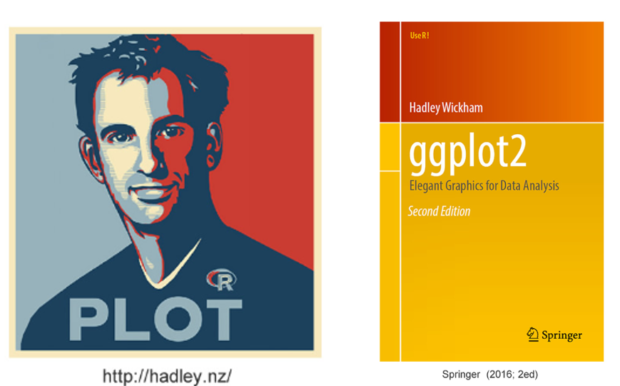
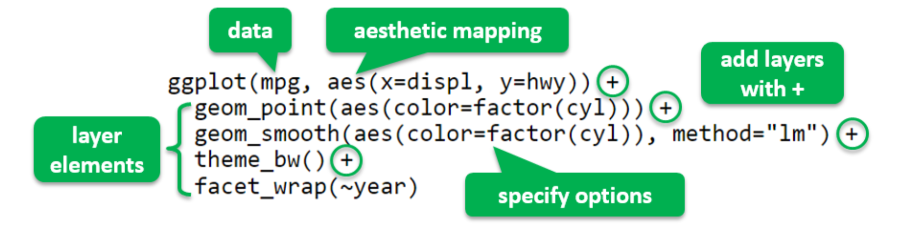

```{r setup, include=FALSE}
knitr::opts_chunk$set(echo = TRUE)
```

<style type="text/css">

body, td {
   font-size: 14px;
}
code.r{
  font-size: 20px;
}
pre {
  font-size: 20px
}
</style>

# 3.1. Grammar of Graphics

## Hadley Wickham and R:ggplot2

- ### Chief scientist at RStudio, Creator of popular R packages: ggplot2, dplyr, tidyr, devtools, etc; “The man who r evolutionized R”.
- ### R graphics: base -> lattice -> ggplot2
"ggplot2, started in 2005, is an attempt to take the good things about base and lattice graphics and improve on them with a strong underlying model" (Hadley Wickham).
- ### R:ggplot2 is one of most commonly downloaded R packages.
- ### Based on Grammar of Graphics by Wilkinson (2005; Springer 2ed).

```{r,echo = FALSE}

```

## Grammar of Graphics (GG) (图形语法)
### Wilkinson(2005)创建了一套用来描述所有统计图形深层特性的语法规则，该语法回答了“什么是统计图形”这一问题。

### 一张统计图形就是从数据到**几何对象**(geometric object，缩写为geom，包括点、线、条形等)的**图形属性**(aesthetic object，缩写为aes，包括颜色、形状、大小等)的一个映射。此外，图形中还可能包含数据的**统计变换**(statistical transformation，缩写为stats)，最后绘制在某个特定的**坐标系**(coordinate system，缩写为coord)中，而**分面**(facet，指将数据绘图窗口划分为若干个子窗口)则可用来生成数据的不同子集的图形。

- ### 最基础的部分是你想要可视化的**数据**以及一系列将数据中的变量对应到图形属性的**映射**;

- ### **几何对象**代表在图中实际看到的图形元素，如点、线、多边形等；

- ### **统计变换**是对数据进行的某种汇总。例如，将数据分组计数以创建直方图；

- ### **标度**的作用是将数据的取值映射到图形空间。占线标度的常见做法是绘制图例和坐标轴；

- ### **坐标系**描述了数据如何映射到图形所在平面，它同时提供了看图所需的坐标轴和网格线；

- ### **分面**描述了如何将数据分解成各个子集，以及如何对子集作图并联合进行展示。分面也叫条件作图或网格作图。

## R:ggplot2 package

- ### The most popular package for producing static visualizations in R; New upgrade to Version 3.2.1; See CRAN for updated information.

- ### Online documentation at https://ggplot2.tidyverse.org/

- ### Download the useful cheatsheet created by Rstudio at https://github.com/rstudio/cheatsheets/blob/main/data-visualization.pdf

- ### Also available in Python.

## Base, Lattice and ggplot2 styles (first impression)

```{r}
par(mar=c(1,3,1,0))
hist(iris$Sepal.Length) # Base graphics
```

```{r}
library(lattice)
histogram(data=iris, ~Sepal.Length|Species)
```

```{r}
library(ggplot2)
ggplot(data=iris,
       aes(x=Sepal.Length, fill=Species)) + 
  geom_histogram(bins=8)
```

```{r}
library(ggplot2)
ggplot(data=iris,
       aes(x=Sepal.Length)) + 
  geom_histogram(bins=8)
```

## You Will Learn ...

- ### R:ggplot2 provides two ways/levels to build graphs: 
  - #### qplot() - quick plot, supplies many defaults
  - #### ggplot() - grammar of graphics plot, with more controls
- ### Options and themes for making sophisticated ggplot2 graphs

- ### Later in this course, ggplot2 will also be used for animated/interactive plots

# 3.2 Quick plots with qplot()

- ### qplot() is analog to base plot(), where "q" means quick
- ### qplot() may create a quick plot with minimum typing
- ### It defines a plot in a single call with the basic syntax: `qplot(dataframe, variables, [geom], options)`
- ### Automatic use of default settings to make life easier
- ### A sensible geom will be picked by default if it is not supplied.

## Histogram

```{r}
library(gridExtra)
qplot(data = iris, Sepal.Length, geom="histogram", bins = 8) 
qplot(data = iris, Sepal.Length, fill=Species, bins = 8)  # default geom
qplot(data = iris, Sepal.Length, color=Species, bins = 8) 
qplot(data = iris, Sepal.Length, facets = .~Species, binwidth = 0.5)  
# grid.arrange(p1,p2,p3, ncol=3)
```
- ### Automatic color setting (color/fill are grouping variables in ggplot2)
- ### Faceting is similar to the conditioning function in Lattice

## Density plot

```{r}
qplot(data = iris, Sepal.Length, geom = "density")
```

```{r}
qplot(data = iris, Sepal.Length, geom = "density",  fill = Species)
```

```{r}
qplot(data = iris, Sepal.Length, geom = "density",  color = Species)
```

## Boxplot with Grouping

```{r}
qplot(data = iris, Species, Sepal.Width, geom="boxplot", main="Boxplot")  
```

```{r}
qplot(data = iris, Species, Sepal.Width, geom="violin", main="Violin Plot")
```

- ### Following data are x (grouping) and y (response) variables

## Bar plot for categoricla variables

```{r}
qplot(data = subset(iris, Sepal.Length>5), Species, geom="bar",  fill=Species)
```

## Scatter plot

```{r}
qplot(data = iris, Sepal.Length, Petal.Length, geom = "point")
```

```{r}
qplot(data = iris, Sepal.Length, Petal.Length, geom = c("point", "smooth"))
```

```{r}
qplot(data = iris, Sepal.Length, Petal.Length, geom = c("point", "smooth"), color = Species) 
```

```{r}
qplot(data = iris, Sepal.Length, Petal.Length, geom = c("point", "smooth"), fill = Species) 
```

# 3.3 ggplot
## Layer-by-layer Syntax

- ### ggplot() builds a plot layer by layer, with the syntax:

```{r,echo = FALSE}

```

- ### ggplot() provides more control than qplot().

## Layer-by-Layer Scatterplot

```{r}
p0 = ggplot(iris, aes(x=Sepal.Length, y=Petal.Length))  
p1 = p0 + geom_point(aes(color=Species)) + ggtitle("Add geom_point with coloring")
p2 = p1 + geom_smooth(aes(color=Species)) + ggtitle("Add geom_smooth")
p3 = p2 + theme_bw() + ggtitle("Add a theme") 
p4 = p3 + facet_wrap(~Species) + ggtitle("Add multipanel facets")
grid.arrange(p1, p2, p3, p4, nrow=2, ncol=2)
```

## Histogram, Freqpoly and Density plots

```{r}
ggplot(iris, aes(Sepal.Length, fill=Species)) + geom_histogram(binwidth = 0.5) 
ggplot(iris, aes(Sepal.Length, color=Species)) + geom_freqpoly(binwidth = 0.5) 
ggplot(iris, aes(Sepal.Length, fill=Species)) + geom_density(alpha=1/3) 
```

## Boxplot

```{r}
iris$SepalFlag = iris$Sepal.Length>5
p1 = ggplot(iris, aes(x=Species, y=Petal.Length, color=Species)) + 
  geom_boxplot(notch = T, show.legend = F) 
p2 = ggplot(iris, aes(x=Species, y=Petal.Length, color=SepalFlag)) + geom_boxplot() 
grid.arrange(p1, p2, ncol=2)
```

## Bar Chart

```{r}
p1 = ggplot(iris, aes(Species, fill=SepalFlag)) + geom_bar(position = "stack") 
p2 = ggplot(iris, aes(Species, fill=Sepal.Length, group=Sepal.Length)) + geom_bar()  
grid.arrange(p1, p2, ncol=2)
```

# 3.4 Options and themes
```{r,out.width=150%}
p1 = ggplot(iris, aes(x=Sepal.Length, y=Petal.Length, colour=Species)) + 
  geom_point() + stat_smooth(method="lm", se=F) +
  labs(title="Iris Flower") + 
  geom_text(aes(7.3, 1.6), label="DataVis", size=6, color="gray50")
p2 = p1 + geom_point() + theme_bw() +
  theme(panel.grid= element_blank()) + scale_color_manual(values = c(2,3,4)) 
grid.arrange(p1, p2, ncol=2)
```

```{r}
library(ggthemes)
p1 +  theme_solarized(light = F) + scale_colour_solarized("red")  # "Solarized Theme"
```

```{r}
p2 = p1 + theme_wsj()  #  "WSJ Theme"
p3 = p1 + theme_economist() + scale_colour_economist()  # "Economist Theme"
grid.arrange(p2, p3, ncol=2)
```

# More examples


# References

- ### [HKU Stat3622 Data Visualization](https://ajzhanghk.github.io/Stat3622/)

- ### [ggplot2. Elegant Graphics for Data Analysis](https://ggplot2-book.org/collective-geoms.html)


